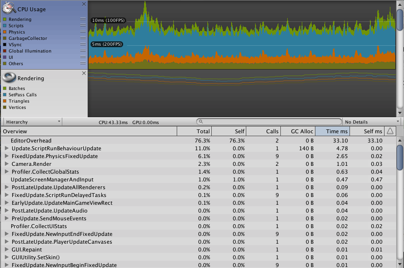
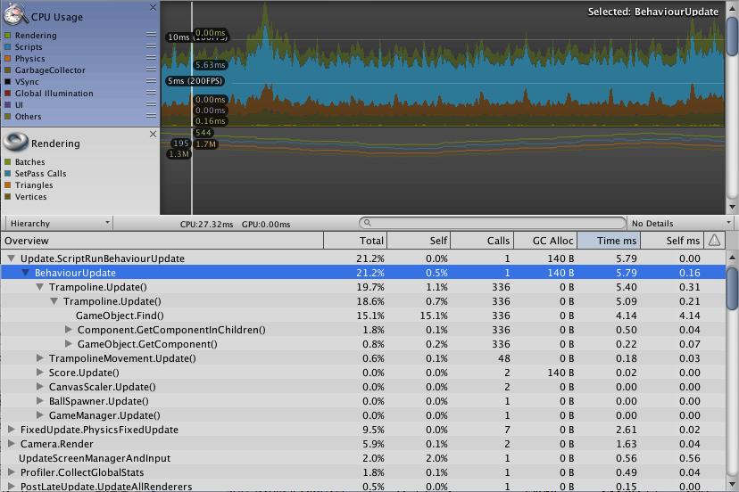
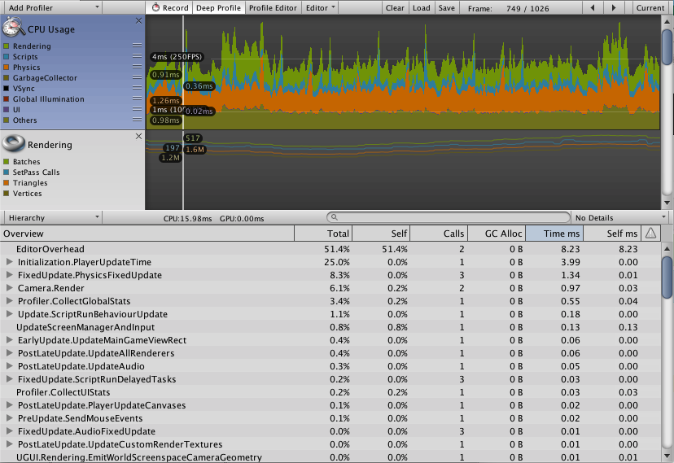
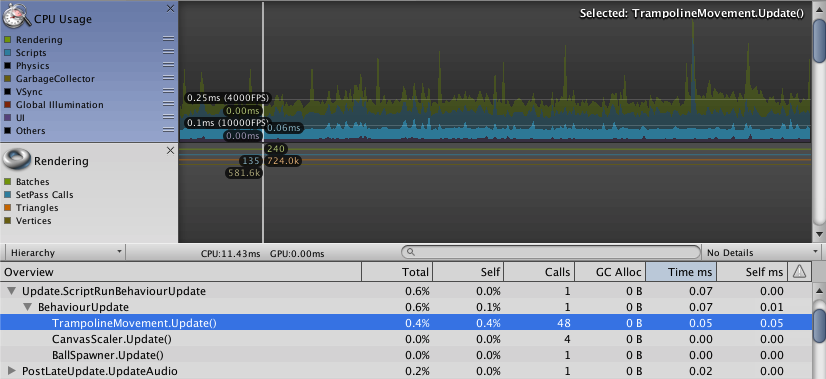
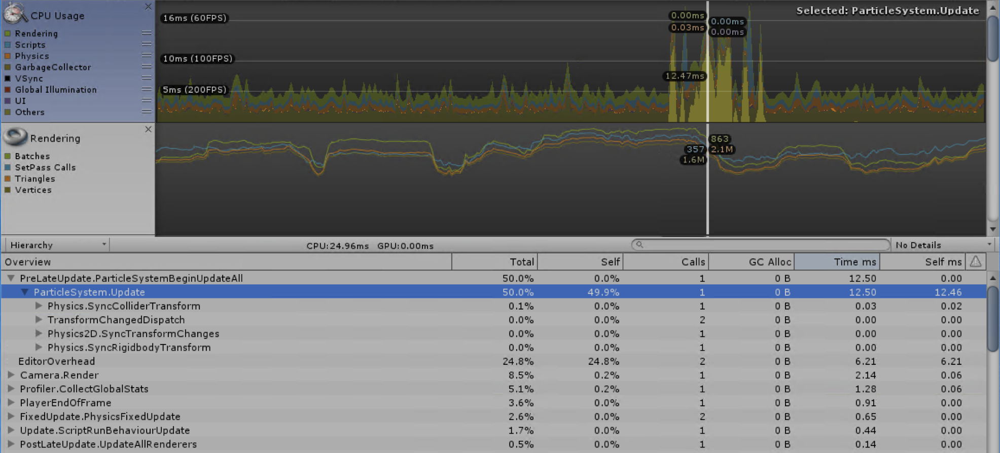
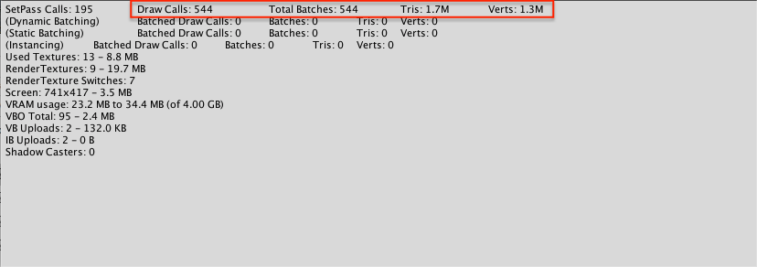
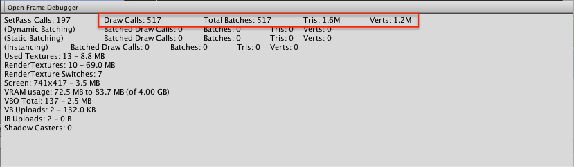
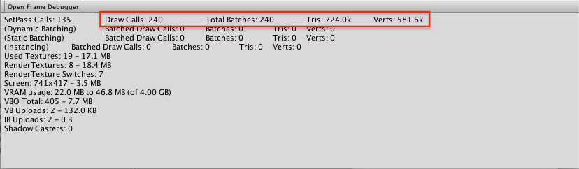

# Performance Bounceback Project
This project documents (through this write-up and changes) a number of 
modifications made to improve performance of a VR application.  The game itself
allows the player to move around the room, throwing balls onto trampolines
within a count down period.

1. [Gameplay Modifications](#gameplay-development-not-optimization)
2. [Profiling and Scripting Optimizations](#profiling)
3. [Graphics Optimizations](#general-graphics)
4. [Source and Administrata](#administrata-considerations)

# Gameplay Development (not optimization)
* Added timing logistics to game manager
    * initial score, time remain counter, public variable for initial game time.
    * added callback structure (instad of in update loop)
    * remove `Update` function and instead use `InvokeRepeating` every half second
    * add game state for begin, play, end of game
* Sound addition
    * added bounce sound for ball when it hits trampoline
    * added music loop that gradually goes up in pitch
    * addded reverb for "factory like" envirionment:w
* Throwable objects
    * a potential issue was found where ball release was using a 
      negative velocity; this issue requires additional investigation (TODO)
    * add touch pad detection to restart the game    

# Scripting
## Update and Start Optimization
* Score: After connecting scoreboard, created cached text variable 
  instead of pulling back a child component every `Update` frame. **(r1)**

# Profiling
## Spotting Spikes
* BallSpawner **(r0)**
    * modified to check if game is running in update loop
    * reuse balls that are too old (since spawn) or too far away from user

## Spotting Constant Time Waste
Looking at profiler, a lot of time was wasted in the
`Update` call of the *Trampoline* script.

* Modified trampoline to use functional score increment **(r1)**
    * Move functions called in `Update` to `Start` 
    * Remove excessive search and component retrieves from `Update`
* Modified scoreboard **(r1)**
    * register and support callback instead of update
    * created four scoreboards along walls for easy visibility

## On-device Optimization (Vive)

<table style='width:100%'>
<tr>
    <th>revision</th>
    <th>commentary and notes</th>
    <th>example profiler image</th>
</tr>
<tr>
    <td>r0</td>
    <td>initial execution time time, with a lot of time devoted to scripting (vsync is removed here)</td>
    <td> </td>
</tr>
<tr>
    <td>r1</td>
    <td>before revision, profile indicator for expensive update operation</td>
    <td> </td>
</tr>
<tr>
    <td>r1</td>
    <td>fixed with game callback and trampoline update improvements</td>
    <td> </td>
</tr>
<tr>
    <td>r2</td>
    <td>demonstration of impact from trampoline movement, next optmization</td>
    <td> </td>
</tr>
<tr>
    <td>r2 (Vive)</td>
    <td>demonstration of bounce/collider effect on runtime performance</td>
    <td> </td>
</tr>
</table>
   

# General Graphics 
## Optimizing Lights
* Mixed lighting - modified all lights to be "mixed" instead of real-time **(r2)**
* Ground Trampolines - updated ground trampoines (those that are not moving) 
  to be static **(r2)**
* Added light probe but no visual difference or performance difference, 
  so rolled-back to not include these extra components

<table style='width:100%'>
<tr>
    <th>revision</th>
    <th>commentary and notes</th>
    <th>example profiler image</th>
</tr>
<tr>
    <td>r0</td>
    <td>initial draw time, with note of the high draw calls, triangles, and verticies</td>
    <td> </td>
</tr>
<tr>
    <td>r1</td>
    <td>reduced draws from updated spawner, scoreboard, game manager</td>
    <td> </td>
</tr>
<tr>
    <td>r2</td>
    <td>halved draws from ground trampolines being made static <em>(both r1 and r2 ar erear facing statistics)</em></td>
    <td> </td>
</tr>
</table>
   

## Optimizing Graphics
* Confirmed that all textures have mipmap already enabled (**Textures -> Generate Mip Maps**)
* Shadow regions looked reasonable, with four-part setting (**Project Settings -> Quality -> Cascade Splits**)

## Optimizing Anti-Alias
* Quality sufficient without aliasing applied, so left off

# Administrata Considerations
This project is part of [Udacity](https://www.udacity.com "Udacity - Be in demand")'s [VR Developer Nanodegree](https://www.udacity.com/course/vr-developer-nanodegree--nd017).

## Content Sources
* [starting bugle race](http://free-loops.com/2091-bugle-call-race.html)
* [buzzer sound](http://www.orangefreesounds.com/game-show-buzzer-sound/)
* [ball bounce](https://freesound.org/people/1479009/sounds/411552/)
* [PimPoy music loop](https://www.dl-sounds.com/royalty-free/pim-poy-pocket/)

## Time Consumed
* Raw Log (to be simplified)
* 5h 20m

## Versions
- Unity 2017.3.0f3+ (for development), originally created in Unity 2017.2.0f3
